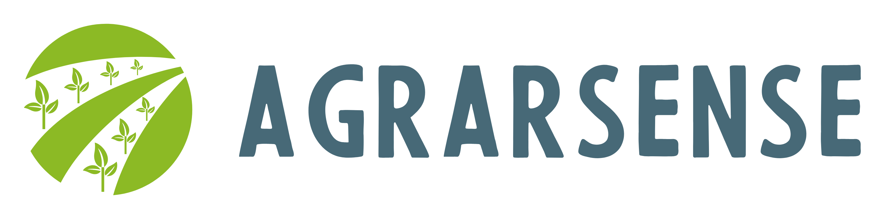

## Important dates

  - Paper submission: Apr 2  (AoE) -- OLD
  - Notification: Apr 25  (AoE) -- OLD
  - Final version: May 1 (AoE) -- OLD

<!-- ## Invited speakers

  - TBA

 -->  <!-- - [Juan Carlos Ruiz](http://www.upv.es/ficha-personal/juaruiga), Universitat Politècnica de València, Spain -->

## About VERDI

The VERDI workshop aims at serving as a discussion forum focused on the area of V&V as a means to guarantee dependability of complex, potentially automated/autonomous CPS. This workshop covers all aspects related to the dependability evaluation (with special focus on __safety__ and __security__) of safety-critical CPS using techniques such as fault/attack-injection, runtime verification, formal verification, semi-formal analysis, simulation, and testing. 

## Previous edition

 - [VERDI 2024](https://verdi-workshop.github.io/2024/), 24 June 2024, Brisbane, Australia

 - [VERDI 2023](https://verdi-workshop.github.io/2023/), 27 June 2023, Porto, Portugal

<!-- See publish.twitter.com, https://developer.twitter.com/en/docs/twitter-for-websites/timelines/guides/profile-timeline -->
<!-- <a class="twitter-timeline"  data-width="600" data-height="600" data-chrome="nofooter" dnt="true" href="https://twitter.com/verdi_workshop?ref_src=twsrc%5Etfw">Tweets by verdi_workshop</a> -->

## Support

{:style="text-align:center;"}
{:target="blank"}
<!-- {:target="blank"}
{:target="blank"} -->
{:target="blank"}
{:target="blank"}
{:target="blank"}
{:target="blank"}
{:target="blank"}
<!-- {:target="blank"} -->

{:class="thanks"}
<small>
<!-- This event is partly supported by the AGRARSENSE project that has received funding from the Chips Joint Undertaking (JU) under Grant Agreement No. 101095835 (project AGRARSENSE). The JU receives support from the European Union’s Horizon 2020 research and innovation programme and Sweden, Spain, France, Ireland, Austria, the Netherlands, Italy, Poland, Germany, Norway, Finland, Latvia, Czechia, Türkiye. -->
VERDI is partially supported by the Route 25 project (ref. TRB/2022/00061 - C645463824-00000063) funded by NextGenerationEU, within the Recovery and Resilience Plan (RRP).
<!-- VERDI is partially supported by the Spanish Ministry of Science, Innovation, and Universities (grant PID2020-120271RB-I00 funded by MCIN/AEI/10.13039/501100011033). -->
</small>

<!-- {:class="thanks"}
<small>Disclaimer: The Chips JU and the European Commission are not responsible for the content on this website or any use that may be made of the information it contains.</small>
 -->

{:class="thanks"}
Photo by [Grafi Jeremiah](https://unsplash.com/@_jeremiah85_) on [Unsplash](https://unsplash.com/photos/a-large-body-of-water-surrounded-by-buildings-I1MBKpoC61k)

<!--  -->

